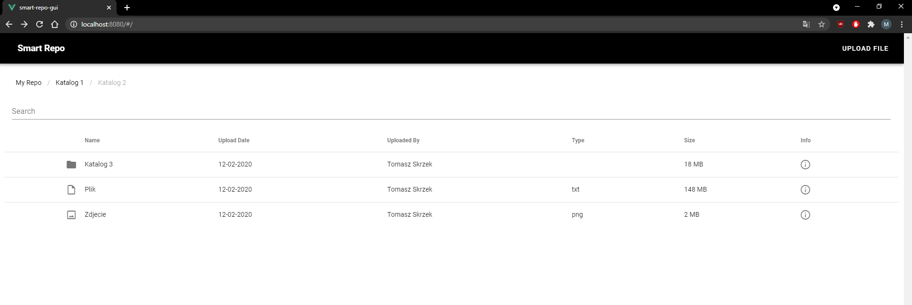
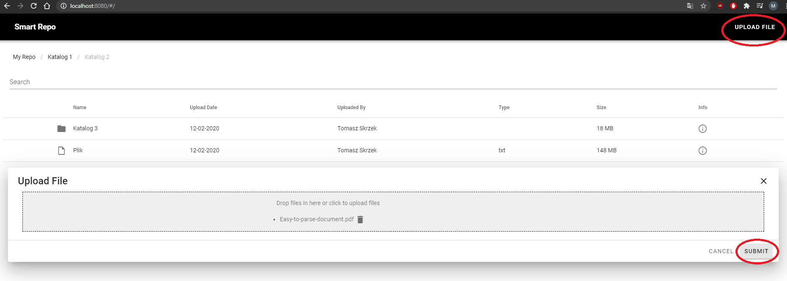
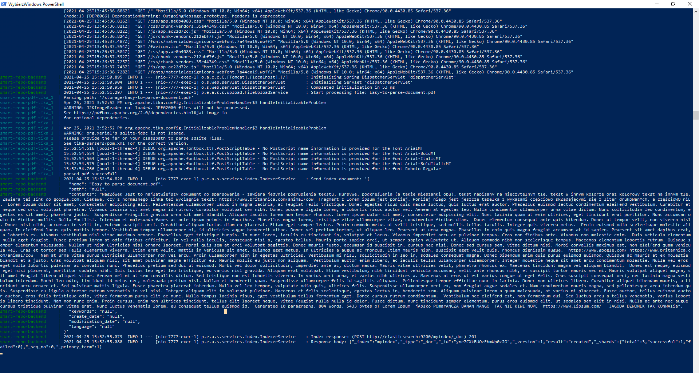
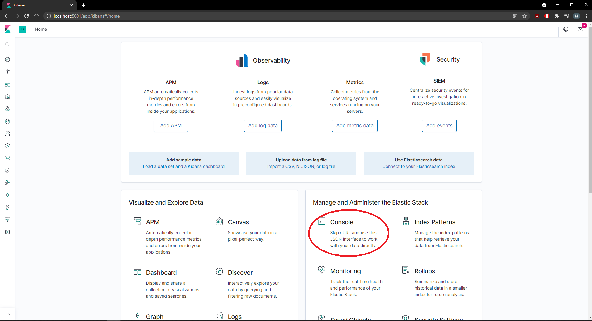
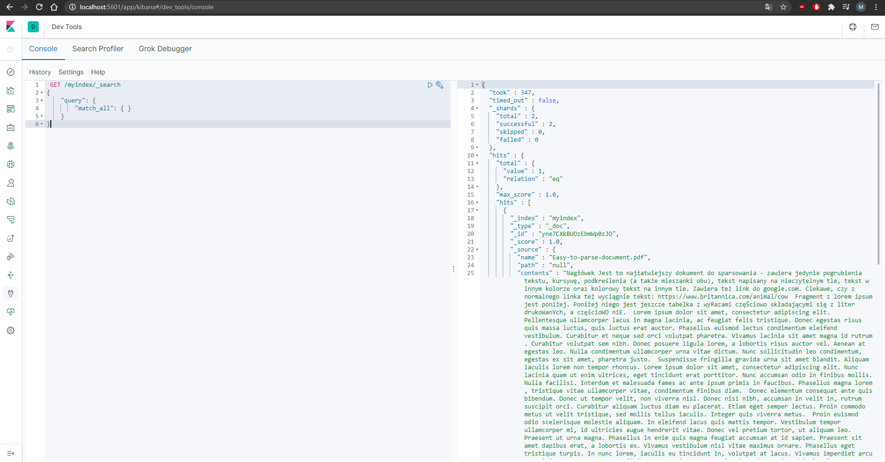

# SmartRepo

## Introduction
The main goal of this project is to provide a smart repository allowing users to keep and search their files of various formats.

## Getting Started
Follow instructions below to have a copy of this project up and running on your local machine for development and testing purposes.

### Prerequisites
You need to have the following software installed on your system:
- [Docker](https://docs.docker.com/get-docker/)
- [Docker Compose](https://docs.docker.com/compose/install/)

### Cloning the repository
Clone the repository to your local machine:
```bash
git clone https://bitbucket.lab.ki.agh.edu.pl/scm/tw2021wtw/smartrepo.git
```

### Running
Navigate to the docker directory from the root of the repository:
```bash
cd smartrepo 
cd docker
```

Run the project with the command below:
```bash
docker-compose up
```

#### GUI - port: 8080



Uploading files:



In the terminal you can see that the file is parsed:



#### Kibana - port: 5601



To view indexed documents you need to send the following query in the Kibana console (but you should upload a file first):

```	bash
 GET /myindex/_search
{
    "query": {
        "match_all": { }
    }
}
```


## Authors:
- Maciej Banaś
- Jakub Caputa
- Monika Dziedzic
- Dominika Młynarczyk
- Dominik Mondzik
- Beata Posłuszny
- Joanna Rostek
- Magdalena Rusek
- Tomasz Skrzek
- Anna Świadek
- Jakub Tomsia
- Mateusz Wieczorek
